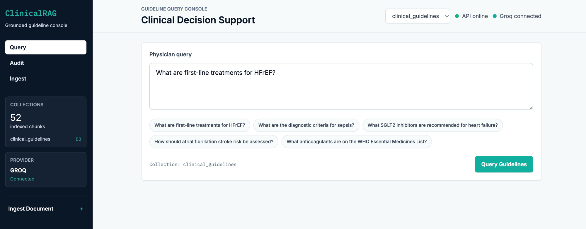

# ClinicalRAG



Citation-grounded RAG for clinical guideline retrieval and question answering.

[Live demo](https://clinicalrag-three.vercel.app)

The public deployment runs in extractive mode: answers are assembled from retrieved
guideline text without a Groq API key.

## What it does

Generation is constrained to the ingested guideline text. Every answer sentence is mapped
back to the source chunk it came from, a grounding score is computed over the whole answer,
off-topic questions and dosage claims absent from the retrieved sources are refused, and
the audit trail stores a hash of each query.

Run it locally in a few minutes, with or without an LLM API key.

## Architecture

```text
React physician console
        |
        v
FastAPI /api/v1/query  (+ rate limit, request IDs, typed models)
        |
        v
LangGraph StateGraph
        |
        +--> guard_query
        |       off-topic / non-clinical refusal, before any embedding work
        |
        +--> decompose
        |       compound split + clinical term lexicon (no LLM)
        |
        +--> retrieve
        |       multi-query ChromaDB + ONNX MiniLM embeddings
        |       deterministic rerank + merge cap
        |
        +--> grade_relevance
        |       Groq llama-3.1-8b-instant  |  MOCK_LLM -> score floor
        |
        +--> generate  (skipped on refusal / empty evidence)
        |       Groq llama-3.3-70b-versatile  |  MOCK_LLM -> extractive
        |
        +--> evaluate_grounding
        |       sentence attribution + unsupported-dosage check
        |       citation coverage
        v
Answer + citations + refusal_reason + hashed audit log
```

[ARCHITECTURE.md](ARCHITECTURE.md) covers the design rationale, the MOCK_LLM path, the
audit model, and production scaling tradeoffs.

## Implementation notes

- LangGraph `StateGraph` with conditional edges that skip generation when the guard fires
  or no relevant documents survive grading.
- Deterministic query decomposition for compound clinical questions. No LLM call, so the
  offline path behaves identically to the live one.
- Per-sentence source attribution by content-token overlap (`rag/citations.py`), reported
  separately from the hybrid grounding score (`rag/evaluator.py`).
- Refusal is a first-class outcome with its own `refusal_reason`. Off-topic prompts, empty
  evidence, and post-generation dosage claims absent from the retrieved sources all refuse.
  Low grounding returns the answer with `confidence=low` and a warning.
- `MOCK_LLM=1` swaps generation for extractive sentence selection and grading for a score
  floor, so tests and evals run without an API key.
- Audit logging hashes the query before storage (`audit/logger.py`), so the audit table
  never holds query text.
- Local Docker validation measured approximately 251 MiB steady-state memory after
  startup and a query.

## Corpus

`backend/data/seed_data.py` holds a small seed corpus used to exercise retrieval. The
entries are summaries written for this repository. `source_url` on each entry points at
the publication being summarized.

## Run locally

```bash
# Backend (mock LLM, no GROQ_API_KEY required)
cd backend
python3.11 -m venv .venv && source .venv/bin/activate
pip install -r requirements.txt
cp -n .env.example .env          # set MOCK_LLM=1
MOCK_LLM=1 uvicorn main:app --reload
```

```bash
# Frontend (separate terminal)
cd frontend
npm install
npm run dev
```

Open `http://localhost:5173`. First backend start seeds the `clinical_guidelines`
collection if it is empty.

Docker equivalent:

```bash
MOCK_LLM=1 docker compose up --build   # API :8000, UI :5173
```

For the live path, set `MOCK_LLM=0` and `GROQ_API_KEY` in
`backend/.env`. Other knobs (`CHROMA_PATH`, `AUDIT_DB_PATH`, `RATE_LIMIT_PER_MINUTE`,
`CORS_ORIGINS`, `ENABLE_INGEST`) are documented in `backend/.env.example` and read through
`backend/config.py`.

## Tests and evaluation

```bash
cd backend && source .venv/bin/activate

# Pure-logic suite, no embedding download
pytest -q tests/test_config.py tests/test_guards.py tests/test_decompose.py \
  tests/test_evaluator.py tests/test_citations.py tests/test_rate_limit.py

# API contracts (stubs retrieval; needs fastapi/httpx from requirements.txt)
pytest -q tests/test_api_unit.py

# Eval harness
python run_evals.py                          # live: Groq + seeded Chroma
MOCK_LLM=1 python run_evals.py --offline     # CI-friendly, no API key
```

`eval_cases.json` holds the regression cases, including off-topic and unsupported-dosage
prompts that must refuse. They pin behaviour on the seed corpus. GitHub Actions runs the
offline unit suite on every push.

## API

```bash
curl http://localhost:8000/health
curl http://localhost:8000/api/v1/ready

curl -X POST http://localhost:8000/api/v1/query \
  -H "Content-Type: application/json" \
  -d '{"query":"What are first-line treatments for HFrEF?","max_sources":3,"collection":"clinical_guidelines"}'
```

The query response carries `sources`, `grounding_score`, `confidence`, `citations`,
`citation_coverage`, and optional `warning` / `refusal_reason`. `/api/v1/ingest` and
`/api/v1/audit` round out the surface; the audit store never contains raw queries.

Useful things to try: a compound question (`"What are first-line treatments for HFrEF?
Also which SGLT2 inhibitors are recommended?"`) exercises decomposition; `"What is the
capital of France?"` returns a refusal with `refusal_reason` set.

## Repository layout

```text
backend/
  api/              routes, Pydantic models, rate limiter
  audit/            SQLite audit logger (hashed queries)
  config.py         env-backed settings
  data/             seed corpus (see Corpus above)
  rag/              decompose, retrieve, guards, citations, pipeline, evaluator
  tests/            offline unit + API contract tests
  eval_cases.json   regression cases
  run_evals.py      harness (--mock/--offline, --json)
frontend/           React + Vite console
docker-compose.yml  local bring-up
ARCHITECTURE.md     design notes
```

## Stack

Python 3.11, FastAPI, LangGraph, LangChain Groq, ChromaDB with
`ONNXMiniLM_L6_V2`, SQLite · React 18, Vite, Tailwind CSS v3, Axios.

## Limitations

- `/api/v1/ingest` and `/api/v1/audit` are unauthenticated. That is fine on localhost; any
  networked deployment needs `ENABLE_INGEST=0` and a locked `CORS_ORIGINS` (compose
  defaults to `*`).
- The seed corpus is small and summarized (see **Corpus**).
- Refusal uses lexical rules: an off-topic lexicon and dosage-string matching against the
  retrieved text.
- In-process rate limiting is single-replica only; multi-replica needs a shared limiter.
- Local Chroma persistence and SQLite audit storage suit a single instance; shared vector
  storage and Postgres would be required beyond that.
- Handling PHI would require BAAs, encryption at rest, access control and monitoring, all
  of which sit outside this repository.
